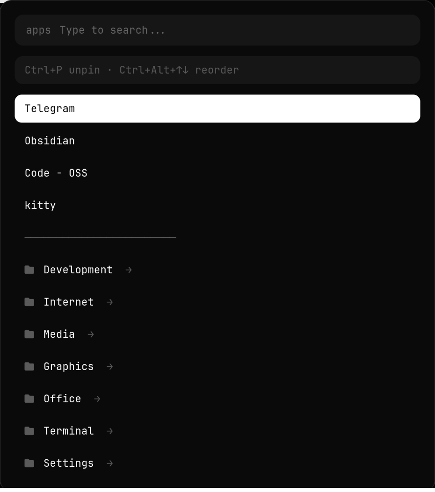
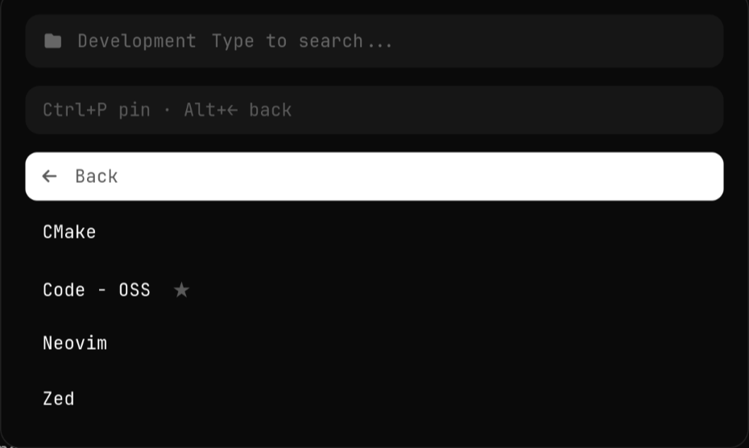

# rofi-launcher

*[Русская версия](README.ru.md)*


An application launcher for rofi with **folders and pinned entries**, instead of
one flat alphabetical list. Your own apps sit at the top in the order you chose;
everything else is one keypress away inside a folder.

<p align="center">
  
  
</p>

`drun` shows you every application at once, in an order rofi picks. That is fine
when you know what you are looking for and awkward when you do not. This keeps
the six things you actually launch at the top and files the rest away.

## Sections

The root is your pinned entries, your folders, and the list of sections. Typing
filters both at once: "wall" finds the Wallpaper section, "fir" finds Firefox.

| Section | What it does | Backed by |
|---|---|---|
| **Clipboard** | history; `Enter` copies, `Ctrl+X` deletes an entry | `cliphist` |
| **Wallpaper** | a grid of thumbnails | own script, separate window |
| **Animations** | animation presets with previews and a live demo | `hyprctl`, `hypr-dissolve` |
| **Windows** | open windows, focus and close | `hyprctl` |
| **Emoji** | 556 symbols, `Enter` copies | own database |
| **Screenshot** | a region or the whole screen | external script |
| **Power** | lock, suspend, hibernate, log out, reboot, shut down | `systemctl`, wlogout's layout |

The irreversible power entries ask for confirmation, and "No" is the first row —
a reflex `Enter` cancels rather than shutting the machine down.

## What's in it

- **Pinned entries in your order.** `Ctrl+P` pins the highlighted app,
  `Ctrl+Alt+↑↓` moves it. Pins live at the top of the root screen.
- **Folders you define.** By `.desktop` category, by name, or "everything" —
  and exclusions to carve things back out.
- **Entering a folder does not recreate the window.** rofi stays open and the
  rows change, so there is no flicker and no lost keyboard focus. `Alt+←` goes
  back.
- **Wrong-layout search.** Typing an app's name without switching keyboard
  layout still finds it — `ghjdjlybr` finds Thunar. Configurable, and easy to
  turn off.
- **Frequency ordering where it helps.** "All applications" puts what you launch
  most at the top; a themed folder stays alphabetical, so an entry is where you
  last saw it.
- **A proper desktop-entry reader.** `NoDisplay`, `Hidden`, `TryExec`,
  `OnlyShowIn`/`NotShowIn` and localised names are all honoured, and field codes
  (`%U`, `%F`, …) never reach the command line.
- **Launching via `gio`**, so `Path=`, startup notification and DBus activation
  work the way the spec says — with a hand-rolled fallback for terminal apps,
  which `gio` refuses to launch unless your terminal is on GLib's own list.

## Requirements

- `rofi` 1.7+ (script mode with `use-hot-keys`)
- Python 3.9+
- Per section, each optional — without it the section says what is missing:
  `cliphist` and `wl-clipboard` (clipboard, emoji), `hyprctl` (windows,
  animations), `python-pillow` (drawing the animation previews)
- A Nerd Font for the folder glyph and the pin star — the bundled theme asks for
  JetBrainsMono Nerd Font
- Optional: `glib2` (`gio`), strongly recommended; without it entries are
  launched by parsing `Exec` by hand

No root. Everything lives under your home directory.

## Installation

```bash
git clone https://github.com/Whyslab/rofi-launcher.git
cd rofi-launcher
./install.sh
```

Then bind it. Hyprland:

```bash
$menu = ~/.local/share/rofi-launcher/bin/hub.sh
bind = SUPER, R, exec, $menu
```

Sway or i3:

```
bindsym $mod+r exec ~/.local/share/rofi-launcher/bin/hub.sh
```

`./install.sh --dry-run` shows what it would do; `./install.sh --prefix /tmp/t`
installs into a throwaway directory.

## Usage

| Key | What it does |
|---|---|
| type | filter, including in the wrong keyboard layout |
| `↑` `↓` | move |
| `Enter` on an app | launch it and close |
| `Enter` on a folder | enter it — the window stays open |
| `Alt+←` | back to the root screen |
| `Ctrl+P` | pin the highlighted app, or unpin it if pinned |
| `Ctrl+Alt+↑↓` | move a pinned entry up or down |
| `Enter` on a section | enter it — the window stays open |
| `Ctrl+X` | delete a clipboard entry, close a window |
| `Esc` | close |

The animations grid has its own pair: `Enter` applies a preset for good,
`Ctrl+Alt+Space` shows it live. Not `Ctrl+Space` — rofi already uses that for
`kb-row-select`, and trying to rebind it makes rofi show an error dialog
instead of the menu.

### Animations

A preset is one JSON file in `data/presets/` describing the whole feel at once:
window, workspace and layer animations, its own bezier curves, and the
`hypr-dissolve` plugin's parameters. Half a preset is not a look.

Applying and previewing are different things:

| | Live preview | Apply |
|---|---|---|
| Mechanism | `hyprctl keyword` | generated config + `hyprctl reload` |
| Writes files | no | yes |
| Undo | `hyprctl reload` | pick another preset |

So previewing cannot damage a configuration: it writes nothing, and `reload` is
a real undo button.

**Both** Hyprland config formats are generated, classic and Lua. The moment a
`hyprland.lua` exists the compositor stops reading `.conf` entirely — and a
`dofile` pointing at a file that is not there drops it to emergency keybinds.

### Defining folders

`~/.config/rofi-launcher/folders.conf`. Section order is the order on screen:

```ini
[Development]
@category: Development
-some-tool.desktop          # everything in the category except this

[Internet]
@category: Network
@category: WebBrowser

[Everyday]
@icon: applications-utilities
firefox.desktop             # named entries, in the order written
thunar.desktop

[All applications]
@all
```

| Directive | Meaning |
|---|---|
| `@all` | every application found |
| `@category: X` | everything whose `.desktop` declares category X |
| `name.desktop` | one specific entry, in the order written |
| `-name.desktop` | exclude, wherever it came from |
| `@icon: name` | an icon for the folder |

Named lines and `@category` can be mixed; an entry never appears twice.
Exclusions apply regardless of where they are in the section.

### Pinned entries

`~/.config/rofi-launcher/favorites.list` is one `.desktop` id per line, in
display order. It is rewritten whenever you press `Ctrl+P` or reorder, so
comments below the header are not preserved — the file is meant to be driven
from the launcher rather than edited.

### Wrong-layout search

Two layouts are stored as strings of the same keys in the same order, so a
search typed in the other one can be translated back. The default pair is
QWERTY and ЙЦУКЕН. To use another pair:

```bash
export ROFI_LAUNCHER_LAYOUT_PRIMARY="qwerty…"
export ROFI_LAUNCHER_LAYOUT_SECONDARY="ασδφγη…"   # the same keys, same order
```

Set either to an empty string to switch the feature off. If the two are
different lengths the feature disables itself rather than mistranslating.

### Other settings

| Variable | Default | Purpose |
|---|---|---|
| `ROFI_LAUNCHER_TERMINAL` | `kitty` | terminal for `Terminal=true` entries |
| `ROFI_LAUNCHER_THEME` | the bundled `hub.rasi` | `.rasi` file for the list; empty means your own rofi config |
| `ROFI_LAUNCHER_GRID_THEME` | the bundled `grid.rasi` | `.rasi` file for the animations grid |
| `ROFI_LAUNCHER_DEBUG` | unset | log every rofi call to `~/.cache/rofi-launcher/debug.log` |

## How it works

rofi's script mode is a conversation over stdout and environment variables
(`man rofi-script`). The script prints rows; rofi shows them and calls the
script again with what happened. State between calls is a single string the
script hands to itself:

```
ROFI_RETV=0                → first call, print the root screen
ROFI_RETV=1, ROFI_INFO=…   → a row was chosen: launch it, or enter a folder
ROFI_RETV=10..28           → Ctrl+P and friends (needs use-hot-keys)
ROFI_DATA=…                → which folder we are in, set by the previous call
```

That is why entering a folder does not recreate the window: nothing restarts,
the same rofi instance just gets a new list.

Debug it without rofi at all:

```bash
ROFI_RETV=0 ./rofi_hub/hub.py | cat -v          # what rofi would receive
ROFI_DATA=emoji ROFI_RETV=0 ./rofi_hub/hub.py   # straight into a section
./rofi_hub/hub.py --dump-apps                   # every entry found
```

Wallpaper and animations are the only two that open a window of **their own**.
They need a grid with large thumbnails, and rofi will not restyle itself
mid-session: its `theme` directive is documented as good only for small things
like a widget's background colour. The hub closes first — two layer-shell
surfaces fight over the keyboard, and the second one silently takes no input.

Key bindings live in `bin/hub.sh` rather than in `~/.config/rofi/config.rasi`, on
purpose: overriding `Ctrl+P` globally would break it for every other rofi menu
on the machine.

> **A trap worth knowing:** rofi resolves a binding by *symbol*, not by physical
> key, so `Ctrl+P` in a non-Latin layout is a different binding entirely
> (`Control+Cyrillic_ze`). Every variant has to be listed, comma-separated, or
> the key silently does nothing half the time. That is what the list in
> `bin/hub.sh` is.

## Limitations

- **Animation previews do not animate.** rofi links only
  `gdk_pixbuf_new_from_file_at_scale`, the single-frame loader — there is no
  `gdk_pixbuf_animation_new_from_file` in the binary at all. A GIF would render
  as its first frame, which for a fade-out is usually an empty rectangle. Each
  tile is drawn from the preset's own numbers instead and shows a motion trail;
  `Ctrl+Alt+Space` shows the real thing.
- **Lists do not refresh while the window is open.** Script mode only calls the
  script on a selection or a hotkey, so windows and clipboard entries are read
  when you enter the section.
- **The wrong-layout pair is one pair.** Two layouts, not three.
- **Icons are text glyphs, not images.** rofi's script mode can show icons per
  row, but each one costs an icon-theme lookup; this stays with glyphs to keep
  the menu instant.
- **`Ctrl+Shift+P` is unbound** by design — with a non-Latin layout it did not
  fire even with all four keysym spellings. `Ctrl+P` toggles instead. The
  handler is still there if you want to bind another key to it.
- **`.desktop` actions are not exposed.** "New window", "New private window"
  and similar sub-entries are ignored; only the main entry is launched.
- **Usage counts are per-id and never decay.** Something you used heavily last
  year keeps its place in "All applications".

## Uninstall

```bash
./uninstall.sh              # remove the program, keep your folders and pins
./uninstall.sh --purge      # remove those too
```

Your key binding is not touched — remove the `SUPER+R` line yourself, or point
it back at `rofi -show drun`.

## Development

```bash
pip install pytest ruff
pytest tests/ -q
ruff check .
```

36 tests: desktop-entry parsing (every way the spec has of saying "do not show
this", and every field code that must not reach argv), folder resolution and
ordering, wrong-layout translation, and the rofi protocol itself — that a
newline or a separator byte inside an application's name cannot shift the rows
rofi parses.

## License

MIT — see [LICENSE](LICENSE).
